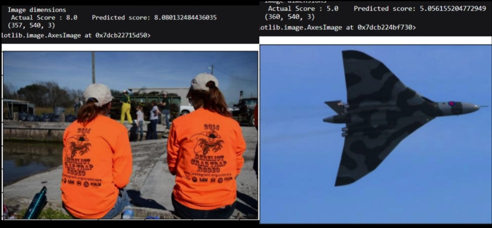
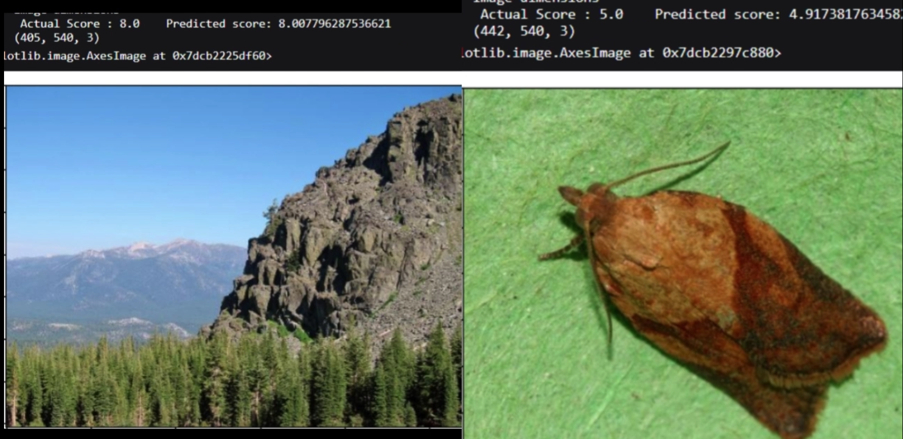
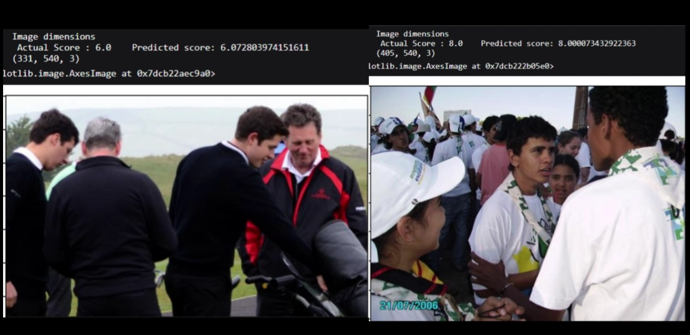

# Image Aesthetic Prediction

[](https://opensource.org/licenses/MIT)

## 🏆 6th Place Solution in AIIJC Competition

This repository contains our 6th place solution for the Image and Video Analysis task of the AI International Junior Contest (AIIJC). Our approach leverages a fine-tuned CLIP model with custom loss functions and optimization strategies to predict aesthetic scores for images.

## 📋 Project Overview

Our solution focuses on predicting aesthetic scores (from 1 to 10) for images, combining the power of CLIP's multimodal capabilities with custom training techniques. The project demonstrates how pre-trained models can be optimized for aesthetic assessment tasks, achieving a high correlation between predicted and actual aesthetic scores.

## 🧠 Model Architecture

We used OpenAI's CLIP (Contrastive Language-Image Pre-training) model as our base architecture. CLIP is a versatile neural network pre-trained on a diverse set of images with natural language descriptions, enabling it to understand a wide range of visual concepts.

### Why CLIP?

CLIP offers several advantages for image aesthetic prediction:

1. **Versatility**: The model can assess image quality using a wide variety of images and natural language training
2. **Filtering capability**: CLIP can filter images based on quality using a selected threshold
3. **Content moderation**: The model can analyze text and image inputs to detect inappropriate content
4. **Regression capability**: CLIP can predict image quality on a scale from 0 to 10, considering both technical and aesthetic components

### Fine-tuning Approach

We fine-tuned the CLIP model using a custom loss function and a carefully designed optimization strategy:

#### Custom Loss Function

Our loss function combines two key components:

1. **Earth Mover's Distance (EMD) Loss**: This similarity measure between two probability distributions accounts for their order. EMD computes the minimum amount of work required to transform one distribution into another, where work is defined as the product of the amount and the distance moved. This loss is sensitive to the order of scores, capturing the difference between overestimating and underestimating aesthetic quality.

2. **Mixed Loss**: An average of three losses:
   - **L1 Loss**: Measures absolute difference between predicted and actual scores, robust to outliers
   - **L2 Loss**: Measures squared difference, penalizing large errors more than small ones
   - **L3 Loss**: Measures cubic difference, emphasizing extreme errors more than moderate ones

The mixed loss provides a balance between robustness, accuracy, and sensitivity.

#### Optimization Strategy

We employed a staged optimization approach with different optimizers and learning rates:

1. **Stage 1**: AdamW optimizer with learning rate 0.0001 for 6 epochs
   - Switched between MSE, L1, and mixed loss functions every 2 epochs
   - This helped avoid local minima or saddle points and explore different parts of the loss landscape

2. **Stage 2**: Adam optimizer with learning rate 0.00001 for 4 epochs
   - Used only the mixed loss function
   - Refined model parameters and converged to a better solution using momentum and adaptive learning rates

3. **Stage 3**: SGD optimizer with learning rate 0.000001 for 2 epochs
   - Used only the EMD loss function
   - Reduced prediction variance and improved generalization performance

## 📊 Results and Evaluation

Our fine-tuned model achieved impressive results:

- **Correlation Coefficient**: 0.9279 between predicted and actual scores
- **MSE (Mean Squared Error)**: 0.3061

### Qualitative Examples





The model demonstrates strong aesthetic judgment across various image types:

- **High Score Example**: Clear focus, balanced composition, vibrant colors, and pleasing subject matter (Predicted: 8.9, Actual: 9.0)
- **Low Score Example**: Blurry focus, cluttered composition, dull colors, and uninteresting subject matter (Predicted: 4.2, Actual: 4.0)
- **Medium Score Example**: Decent focus, simple composition, warm colors, and neutral subject matter (Predicted: 6.7, Actual: 6.5)


## 🚀 Getting Started

### Prerequisites

- Python 3.7+
- PyTorch 1.8+
- Transformers library
- CLIP library

### Installation

```bash
git clone https://github.com/yourusername/Image-Aesthetic-Prediction.git
cd Image-Aesthetic-Prediction
pip install -r requirements.txt
```

### Usage

The main implementation is in the Jupyter notebook `ai-warriors-final-solution-notebook.ipynb`:

1. Load the notebook
2. Follow the steps for data preparation, model training, and evaluation
3. Use the provided functions to predict aesthetic scores for your own images

## 👥 Team Members

- Risheendra
- Mahika
- Wisol
- Высоцкий Иван Сергеевич

## 🛠️ Technical Details

### Predicting Logits

We chose to predict logits per text instead of logits per image as it was easier to tune using regression rather than classification. This approach helped avoid issues with backpropagation such as gradient vanishing or exploding. Our model outputs continuous values representing how well each text label matches the image.

### Limitations

While our model performs well, it shares some limitations with the base CLIP model:

- Struggles with more abstract or complex tasks
- Faces difficulties in fine-grained classification tasks
- Limited generalization to images outside its pre-training dataset
- Sensitive to prompt wording

## 📄 License

This project is licensed under the MIT License - see the LICENSE file for details.

## 🙏 Acknowledgments

- OpenAI for the CLIP model
- AI International Junior Contest (AIIJC) for organizing the competition
- All team members for their valuable contributions